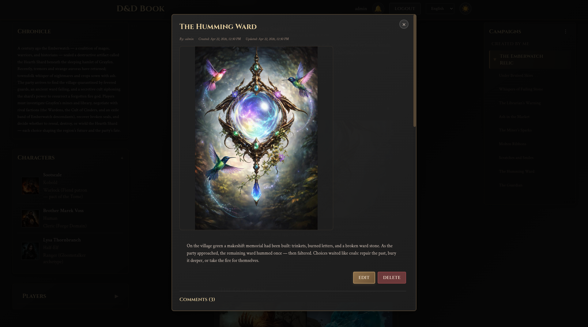
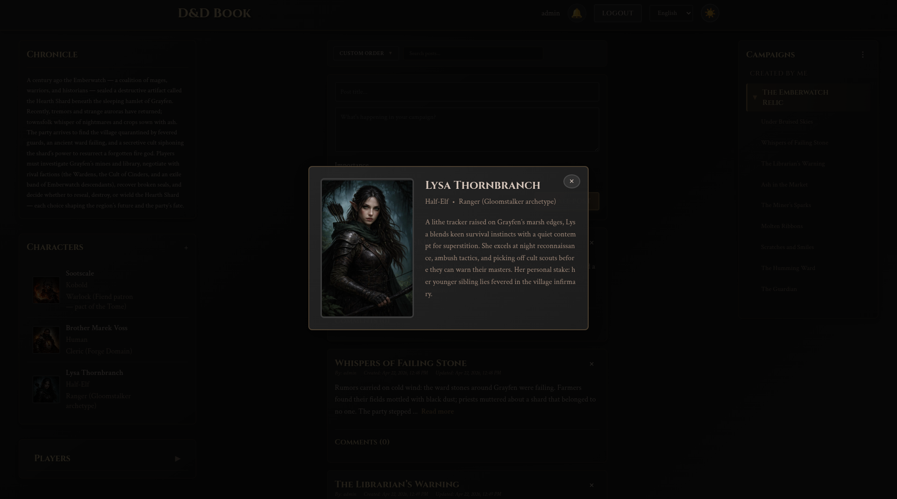

<div align="center">
  
  
  ### *Your Campaign's Chronicle Awaits*
  
  [](https://www.gnu.org/licenses/gpl-3.0)
  [](docker-compose.standalone.yaml)
  [](https://github.com/grimirg/dndbook/actions)
  [](https://github.com/grimirg/dndbook/issues)
  [](https://github.com/grimirg/dndbook/pulls)
  
</div>

---

## Welcome, Adventurer!

In the realm of tabletop role-playing, every campaign tells a story—of heroes forged in battle, of kingdoms saved or lost, of friendships tested and legends born. But as any seasoned Dungeon Master knows, keeping track of these epic tales can be as challenging as facing a dragon in its lair.

**D&D Book** is your digital grimoire, a powerful web platform designed to chronicle your Dungeons & Dragons campaigns with the care they deserve. Whether you're a DM weaving intricate plots or a player documenting your character's journey, this tool transforms chaos into order, scattered notes into organized lore. Is more than just a management tool; it’s the living chronicle of your journey. While most apps focus on the math of the game, we focus on the story. Designed to reflect the look and feel of a campaign journal, it transforms scattered notes into a structured digital book. Built with usability at its core and designed for the homelab community, it gives you total ownership of your lore. Whether you're a DM or a player, your campaign's legacy finally has a home that is easy to use and entirely yours to host.

### Features

- **📚 Campaign Management**: Create and organize multiple campaigns with detailed descriptions
- **👥 Party Collaboration**: Invite players to join your campaigns and collaborate in real-time
- **📝 Session Chronicles**: Document your adventures with rich text posts and image galleries
- **🎭 Character Profiles**: Build detailed character sheets with portraits and backstories
- **💬 Interactive Comments**: Discuss sessions and share memories with your party
- **📤 Export & Import**: Backup and transfer your campaigns between instances
- **🌍 Multi-language Support**: Available in English, Italian, German, Spanish, and French
- **🔒 Secure & Private**: Your campaigns are protected with JWT authentication
- **🌙 Dark Mode**: Easy on the eyes during those late-night gaming sessions

---

See D&D Book in action! Here are some screenshots showcasing some features:

<div align="center">
  
  <br/><br/>
  <a href="demo-screenshots/2.png"></a>
  <a href="demo-screenshots/3.png"></a>
  <br/><br/>
  <a href="demo-screenshots/4.png"></a>
  <a href="demo-screenshots/5.png"></a>
</div>

---

## Table of Contents

- [Quick Start](#-quick-start)
  - [Option 1: Docker Standalone](#-option-1-docker-standalone-recommended---easiest)
  - [Option 2: Homelab Deployment](#-option-2-homelab-deployment)
  - [Option 3: Standalone (For Developers)](#-option-3-standalone-for-developers)
- [User Manual](#-user-manual)
- [Project Structure](#-project-structure)
- [Configuration](#️-configuration)
- [Database Initialization](#️-database-initialization)
- [Useful Commands](#️-useful-commands)
- [Common Issues](#-common-issues)
- [Contributing](#-contributing)
- [License](#-license)
- [Support the Project](#-support-the-project)

---

> **⚠️ Development Notice**  
> This project is under active development. You may encounter bugs or unexpected behavior. We appreciate your patience and welcome any feedback or bug reports to help improve the application!

---


## 🚀 Quick Start

There are **three ways** to run the application. Choose the one that fits your needs:

### 🐳 Option 1: Docker Standalone (Recommended - Easiest)

**Best for:** You want to start everything with a single command, without installing anything on your computer.

**Requirements:**
- Docker installed on your computer

**Steps:**

1. **Configure the application**
   ```bash
   cp .env.example .env
   ```
   Open the `.env` file and modify the values (especially passwords!).

2. **Start everything**
   ```bash
   ./start-docker.sh
   ```
   The database will be automatically initialized on first startup.

3. **Open your browser**
   - Go to: http://localhost
   - Username: `admin`
   - Password: `admin123` (change it immediately after first login!)

**To stop:**
```bash
./stop-docker.sh
```

---

### 🏠 Option 2: Homelab Deployment

**Best for:** You have an existing homelab with shared services (PostgreSQL, Nginx reverse proxy).

**⚠️ Important:** This configuration assumes your homelab is set up similarly to the reference implementation (shared PostgreSQL, external Docker network, Nginx reverse proxy). If your setup differs, you'll need to customize the configuration accordingly.

**Requirements:**
- Existing PostgreSQL database
- Nginx reverse proxy
- Docker and Docker Compose

**Steps:**

1. **Copy the template file**
   ```bash
   cp docker-compose.yaml.template docker-compose.yaml
   ```

2. **Configure environment variables**
   
   Edit your homelab's `.env` file and add these variables:
   ```bash
   # Database (use your existing PostgreSQL)
   DNDBOOK_DB_NAME=dndbook_db
   DNDBOOK_DB_USER=dndbook_user
   DNDBOOK_DB_PASS=your-secure-password
   
   # Security Keys
   SECRET_KEY=your-secret-key-here
   JWT_SECRET_KEY=your-jwt-secret-here
   ADMIN_PASSWORD=your-admin-password
   
   # Application Settings
   MOCK_DATA=false
   UPLOAD_FOLDER=uploads
   MAX_CONTENT_LENGTH=16777216
   POSTS_PER_PAGE=10
   
   # Frontend Settings
   VITE_API_URL=/api
   VITE_MOCK_DATA=false
   VITE_AVAILABLE_LOCALES=en,it,de,es,fr
   VITE_POSTS_PER_PAGE=10
   VITE_POST_PREVIEW_LIMIT=200
   
   # Homelab Infrastructure
   HOST_UID=1000
   HOST_GID=1000
   SHARED_NETWORK=your_network_name
   ```

3. **Configure Nginx**
   
   Use `nginx.conf.template` as reference for your reverse proxy configuration.

4. **Initialize the database**
   ```bash
   psql -h your_postgres_host -p 5432 -U dndbook_user -d dndbook_db -f be/init-db.sql
   ```

5. **Start the application**
   ```bash
   docker-compose up -d
   ```

**Note:** The `docker-compose.yaml.template` expects:
- PostgreSQL accessible at `shared_postgres:5432`
- An external Docker network for service communication
- Nginx handling SSL/TLS termination and routing

---

### 💻 Option 3: Standalone (For Developers)

**Best for:** You want to develop or modify the code.

**Requirements:**
- Python 3.8+ installed
- Node.js 18+ installed
- Docker (only for PostgreSQL database)

**Steps:**

1. **Configure the application**
   ```bash
   cp .env.example .env
   ```
   Open the `.env` file and modify the values.

2. **Start everything**
   ```bash
   ./start-standalone.sh
   ```
   This script will automatically start:
   - PostgreSQL database (in Docker)
   - Backend (Python/Flask)
   - Frontend (Vue.js)
   The database will be automatically initialized on first startup.

3. **Open your browser**
   - Frontend: http://localhost:5173
   - Backend API: http://localhost:5000
   - Username: `admin`
   - Password: `admin123` (change it immediately after first login!)

**To stop:**
```bash
./stop-standalone.sh
```

---

## 📖 User Manual

Once you have D&D Book up and running, check out the [User Manual](USER_MANUAL.md) for detailed instructions on how to use all the application features:

- Campaign management and configuration
- Character creation and management
- Creating posts with images and importance levels
- Inviting players and collaborating
- Import/export functionality
- And much more!

---

## 📁 Project Structure

```
dndbook/
├── .env                    # Main configuration (create this)
├── start-docker.sh         # Start with Docker
├── start-standalone.sh     # Start in development mode
├── be/                     # Backend (Python/Flask)
│   ├── .env               # Backend configuration (optional)
│   └── run-standalone.sh  # Start backend only
└── fe/                     # Frontend (Vue.js)
    ├── .env               # Frontend configuration (optional)
    └── run-standalone.sh  # Start frontend only
```

---

## ⚙️ Configuration

The application is configured through environment variables in the `.env` file.

### Main `.env` File

Copy the example file and customize it:
```bash
cp .env.example .env
```

**Critical security settings (change these!):**
```bash
# PostgreSQL Database
POSTGRES_USER=dndbook_user
POSTGRES_PASSWORD=change-this-password      # ⚠️ CHANGE THIS!
POSTGRES_DB=dndbook_db

# Security Keys (generate new random keys for production)
SECRET_KEY=change-this-key                  # ⚠️ CHANGE THIS!
JWT_SECRET_KEY=change-this-key              # ⚠️ CHANGE THIS!
```

**Generate secure keys:**
```bash
python3 -c "import secrets; print(secrets.token_hex(32))"
```

### Advanced Configuration (Optional)

You can override settings for specific components:
- **Backend only**: Create `be/.env` (overrides root `.env` for backend)
- **Frontend only**: Create `fe/.env` (overrides root `.env` for frontend)

---

## 🗄️ Database Initialization

The database is automatically initialized on first startup using the SQL script located in `be/docker-entrypoint-initdb.d/init-db.sql`. No manual steps are required.

**What the script does:**
- Creates all necessary database tables
- Creates the default admin user (username: `admin`, password: `admin123`)

**Important:**
- Change the admin password immediately after first login
- The script is safe to run multiple times (it won't duplicate data)

**For Homelab Deployment:**
If you're using the Homelab deployment option with an existing PostgreSQL, you'll need to manually run the initialization script once:

```bash
psql -h your_postgres_host -p 5432 -U dndbook_user -d dndbook_db -f be/docker-entrypoint-initdb.d/init-db.sql
```

---

## 🛠️ Useful Commands

### Docker
```bash
# View logs
docker compose -f docker-compose.standalone.yaml logs -f

# Restart services
docker compose -f docker-compose.standalone.yaml restart

# Stop and remove everything (including database!)
docker compose -f docker-compose.standalone.yaml down -v
```

### Standalone
```bash
# Start backend only
cd be && ./run-standalone.sh

# Start frontend only
cd fe && ./run-standalone.sh

# View active processes
ps aux | grep -E "python|vite"
```

---

## 🆘 Common Issues

### "Port already in use"
Another program is using port 80 (Docker Standalone) or 5173/5000 (Standalone). Stop the other program or change the port in `.env`.

### "Database connection failed"
- Make sure Docker is running
- Verify the database container is started: `docker ps`
- Check that credentials in `.env` match your database settings

### "psql: command not found"
Install the PostgreSQL client:
- **Ubuntu/Debian**: `sudo apt-get install postgresql-client`
- **macOS**: `brew install postgresql`
- **Windows**: Download from https://www.postgresql.org/download/

### "Missing required environment variables"
You forgot to create the `.env` file. Run: `cp .env.example .env`

### Frontend can't connect to backend
Check that `VITE_API_URL` in `.env` is correct:
- **Homelab**: `VITE_API_URL=/api` (or your custom API path)
- **Docker Standalone**: `VITE_API_URL=http://localhost:5000`
- **Standalone Dev**: `VITE_API_URL=http://localhost:5000`

**How it works:** The frontend prepends `VITE_API_URL` to all API calls. For example:
- With `VITE_API_URL=/api` → `/auth/login` becomes `/api/auth/login`
- With `VITE_API_URL=http://localhost:5000` → `/auth/login` becomes `http://localhost:5000/auth/login`

---

## 🤝 Contributing

We welcome contributions from the community! Whether you're fixing bugs, adding new features, improving documentation, or translating the interface, your help is greatly appreciated.

For detailed technical instructions on how to contribute, including:
- Development setup
- Project architecture
- Adding new languages
- Creating API endpoints
- Writing tests

Please see the [CONTRIBUTING.md](CONTRIBUTING.md) file.

- **Report a bug**: [Open an Issue](https://github.com/grimirg/dndbook/issues)
- **Request a feature**: [Open an Issue](https://github.com/grimirg/dndbook/issues)
- **Submit a pull request**: [Open a Pull Request](https://github.com/grimirg/dndbook/pulls)

---

## 📄 License

This project is licensed under the **GNU General Public License v3.0 (GPLv3)**.

### What This Means

- ✅ You are free to use, modify, and distribute this software
- ✅ You can use it for personal and commercial projects
- ✅ Any modifications must also be released under GPLv3
- ❌ You cannot use this software in proprietary/closed-source products
- ❌ You cannot remove the license or attribution
- ❌ You cannot use this project for profit-making activities without releasing your modifications

### Summary

D&D Book is free and open-source software. We believe in sharing knowledge and building tools that benefit the entire tabletop gaming community. The GPLv3 ensures that any improvements to this project remain free and open for everyone.

For the full license text, see [LICENSE](LICENSE).

---

## 💖 Support the Project

If you find D&D Book useful and want to support its development, consider making a donation via PayPal. Your support helps keep the project alive and enables new features!

[]()

Every contribution, no matter how small, is greatly appreciated! 🙏
