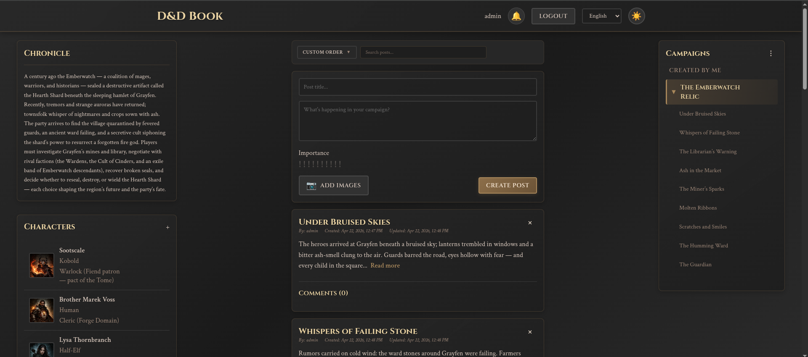
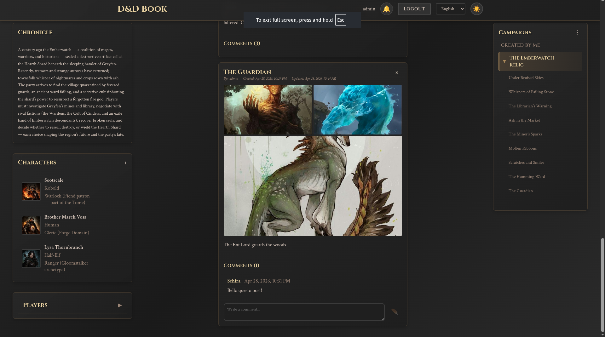
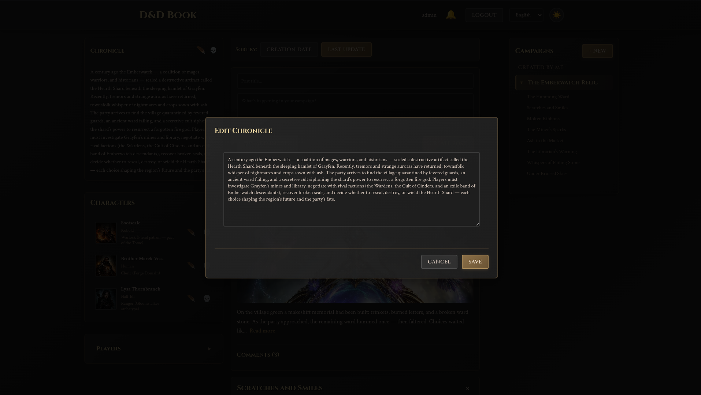

<div align="center">
  
  
  ### *Your Campaign's Chronicle Awaits*
  
  [](LICENSE)
  [](docker-compose.standalone.yaml)
  
</div>

---

## Welcome, Adventurer!

In the realm of tabletop role-playing, every campaign tells a story—of heroes forged in battle, of kingdoms saved or lost, of friendships tested and legends born. But as any seasoned Dungeon Master knows, keeping track of these epic tales can be as challenging as facing a dragon in its lair.

**D&D Book** is your digital grimoire, a powerful web platform designed to chronicle your Dungeons & Dragons campaigns with the care they deserve. Whether you're a DM weaving intricate plots or a player documenting your character's journey, this tool transforms chaos into order, scattered notes into organized lore.

### Features

- **📚 Campaign Management**: Create and organize multiple campaigns with detailed descriptions
- **👥 Party Collaboration**: Invite players to join your campaigns and collaborate in real-time
- **📝 Session Chronicles**: Document your adventures with rich text posts and image galleries
- **🎭 Character Profiles**: Build detailed character sheets with portraits and backstories
- **💬 Interactive Comments**: Discuss sessions and share memories with your party
- **📤 Export & Import**: Backup and transfer your campaigns between instances
- **🌍 Multi-language Support**: Available in English, Italian, German, Spanish, and French
- **🔒 Secure & Private**: Your campaigns are protected with JWT authentication
- **🌙 Dark Mode**: Easy on the eyes during those late-night gaming sessions

---

See D&D Book in action! Here are some screenshots showcasing some features:

<div align="center">
  
  <br/><br/>
  <a href="demo-screenshots/2.png"></a>
  <a href="demo-screenshots/3.png"></a>
</div>

---

## Table of Contents

- [Quick Start](#-quick-start)
  - [Option 1: Docker Standalone](#-option-1-docker-standalone-recommended---easiest)
  - [Option 2: Homelab Deployment](#-option-2-homelab-deployment)
  - [Option 3: Standalone (For Developers)](#-option-3-standalone-for-developers)
- [Project Structure](#-project-structure)
- [Configuration](#️-configuration)
- [Useful Commands](#️-useful-commands)
- [Common Issues](#-common-issues)
- [Notes](#-notes)
- [Support the Project](#-support-the-project)

---

> **⚠️ Development Notice**  
> This project is under active development. You may encounter bugs or unexpected behavior. We appreciate your patience and welcome any feedback or bug reports to help improve the application!

---


## 🚀 Quick Start

There are **three ways** to run the application. Choose the one that fits your needs:

### 🐳 Option 1: Docker Standalone (Recommended - Easiest)

**Best for:** You want to start everything with a single command, without installing anything on your computer.

**Requirements:**
- Docker installed on your computer

**Steps:**

1. **Configure the application**
   ```bash
   cp .env.example .env
   ```
   Then open the `.env` file and modify the values (especially passwords!).

2. **Start everything**
   ```bash
   ./start-docker.sh
   ```

3. **Open your browser**
   - Go to: http://localhost
   - Username: `admin`
   - Password: the one you set in `.env`

**To stop:**
```bash
./stop-docker.sh
```

---

### 🏠 Option 2: Homelab Deployment

**Best for:** You have an existing homelab with shared services (PostgreSQL, Nginx reverse proxy).

**⚠️ Important:** This configuration assumes your homelab is set up similarly to the reference implementation (shared PostgreSQL, external Docker network, Nginx reverse proxy). If your setup differs, you'll need to customize the configuration accordingly.

**Requirements:**
- Existing PostgreSQL database
- Nginx reverse proxy
- Docker and Docker Compose

**Steps:**

1. **Copy the template file**
   ```bash
   cp docker-compose.yaml.template docker-compose.yaml
   ```

2. **Configure environment variables**
   
   Edit your homelab's `.env` file and add these variables:
   ```bash
   # Database (use your existing PostgreSQL)
   DNDBOOK_DB_NAME=dndbook_db
   DNDBOOK_DB_USER=dndbook_user
   DNDBOOK_DB_PASS=your-secure-password
   
   # Security Keys
   SECRET_KEY=your-secret-key-here
   JWT_SECRET_KEY=your-jwt-secret-here
   ADMIN_PASSWORD=your-admin-password
   
   # Application Settings
   MOCK_DATA=false
   UPLOAD_FOLDER=uploads
   MAX_CONTENT_LENGTH=16777216
   POSTS_PER_PAGE=10
   
   # Frontend Settings
   VITE_API_URL=/api
   VITE_MOCK_DATA=false
   VITE_AVAILABLE_LOCALES=en,it,de,es,fr
   VITE_POSTS_PER_PAGE=10
   VITE_POST_PREVIEW_LIMIT=200
   
   # Homelab Infrastructure
   HOST_UID=1000
   HOST_GID=1000
   SHARED_NETWORK=your_network_name
   ```

3. **Configure Nginx**
   
   Use `nginx.conf.template` as reference for your reverse proxy configuration.

4. **Start the application**
   ```bash
   docker-compose up -d
   ```

**Note:** The `docker-compose.yaml.template` expects:
- PostgreSQL accessible at `shared_postgres:5432`
- An external Docker network for service communication
- Nginx handling SSL/TLS termination and routing

---

### 💻 Option 3: Standalone (For Developers)

**Best for:** You want to develop or modify the code.

**Requirements:**
- Python 3.8+ installed
- Node.js 18+ installed
- Docker (only for PostgreSQL database)

**Steps:**

1. **Configure the application**
   ```bash
   cp .env.example .env
   ```
   Then open the `.env` file and modify the values.

2. **Start everything**
   ```bash
   ./start-standalone.sh
   ```
   This script will automatically start:
   - PostgreSQL database (in Docker)
   - Backend (Python/Flask)
   - Frontend (Vue.js)

3. **Open your browser**
   - Frontend: http://localhost:5173
   - Backend API: http://localhost:5000
   - Username: `admin`
   - Password: the one you set in `.env`

**To stop:**
```bash
./stop-standalone.sh
```

---

## 📁 Project Structure

```
dndbook/
├── .env                    # Main configuration (create this)
├── start-docker.sh         # Start with Docker
├── start-standalone.sh     # Start in development mode
├── be/                     # Backend (Python/Flask)
│   ├── .env               # Backend configuration (optional)
│   └── run-standalone.sh  # Start backend only
└── fe/                     # Frontend (Vue.js)
    ├── .env               # Frontend configuration (optional)
    └── run-standalone.sh  # Start frontend only
```

---

## ⚙️ Configuration

### Main `.env` File

The `.env` file in the root folder contains **all** the application configuration.

**Important variables to change:**

```bash
# PostgreSQL Database
POSTGRES_USER=dndbook_user
POSTGRES_PASSWORD=change-this-password      # ⚠️ IMPORTANT!
POSTGRES_DB=dndbook_db

# Security Keys (generate new keys for production!)
SECRET_KEY=change-this-key                  # ⚠️ IMPORTANT!
JWT_SECRET_KEY=change-this-key              # ⚠️ IMPORTANT!

# Admin Password
ADMIN_PASSWORD=admin123                      # ⚠️ IMPORTANT!
```

**To generate secure keys:**
```bash
python3 -c "import secrets; print(secrets.token_hex(32))"
```

### Advanced Configuration (Optional)

If you want to customize only the backend or frontend:
- **Backend**: Create `be/.env` (variables here override those in root `.env`)
- **Frontend**: Create `fe/.env` (variables here override those in root `.env`)

---

## 🛠️ Useful Commands

### Docker
```bash
# View logs
docker compose -f docker-compose.standalone.yaml logs -f

# Restart services
docker compose -f docker-compose.standalone.yaml restart

# Stop and remove everything (including database!)
docker compose -f docker-compose.standalone.yaml down -v
```

### Standalone
```bash
# Start backend only
cd be && ./run-standalone.sh

# Start frontend only
cd fe && ./run-standalone.sh

# View active processes
ps aux | grep -E "python|vite"
```

---

## 🆘 Common Issues

### "Port already in use"
Another program is using the port. Stop the other program or change the port in `.env`.

### "Database connection failed"
Make sure Docker is running and the credentials in `.env` are correct.

### "Missing required environment variables"
You forgot to create the `.env` file. Run: `cp .env.example .env`

### Frontend can't connect to backend
Check that `VITE_API_URL` in `.env` is correct:
- **Homelab**: `VITE_API_URL=/api` (or your custom API path)
- **Docker Standalone**: `VITE_API_URL=http://localhost:5000`
- **Standalone Dev**: `VITE_API_URL=http://localhost:5000`

**Note:** The frontend code uses paths like `/auth/login`, `/campaigns`, etc. The `VITE_API_URL` is prepended to these paths, so:
- With `VITE_API_URL=/api` → calls become `/api/auth/login`
- With `VITE_API_URL=http://localhost:5000` → calls become `http://localhost:5000/auth/login`

---

## 📝 Notes

- The `.env` file contains passwords and secret keys: **DO NOT share it** and **DO NOT upload it to Git**
- For production, always generate new random secret keys
- The database is saved in a Docker volume, so your data persists even after stopping the application

---

## 💖 Support the Project

If you find D&D Book useful and want to support its development, consider making a donation via PayPal. Your support helps keep the project alive and enables new features!

[]()

Every contribution, no matter how small, is greatly appreciated! 🙏
